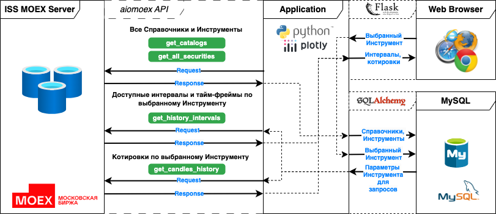
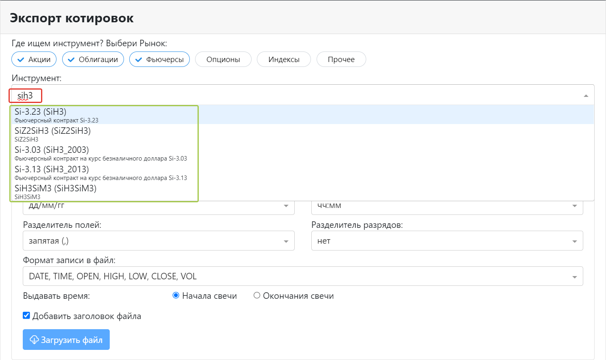

# Приложение для получения исторических котировок с информационного сервера Московской Биржи.

Содержание:
1. [Ограничения](#ограничения)
2. [Демо](#демо)
3. [Архитектура приложения](#архитектура-приложения)
4. [Зависимости](#зависимости)
5. [Установка и запуск](#установка-и-запуск)
6. [Описание функционала в файлах проекта](#описание-функционала-в-файлах-проекта)
7. [Применение с библиотекой Backtrader](#применение-в-backtrader)

## Ограничения

Использование исторических котировок - неотъемлемая часть проверки и оценки жизнеспособности торговой стратегии. 
Сейчас в рунете представлено несколько сервисов для получения исторических котировок, наиболее полный обзор которых можно найти в 
финансовом журнале Финама по [ссылке](https://www.finam.ru/publications/item/kak-vybrat-servis-eksporta-kotirovok-20240416-1631/). 

Данное приложение также предназначено для экспорта исторических котировок и имеет следующие ограничения:

- минимальный тайм-фрейм - 1 минута. Сделки не доступны.
- доступны только инструменты, которые торговались или торгуются на Московской Бирже MOEX.
- котировки доступны с 2012 года.

Дизайн главной (и единственной) страницы приложения заимствован с аналогичного сервиса Финам, который доступен по 
[ссылке](https://www.finam.ru/quote/moex/sibn/export/). Существенным преимуществом данного приложения является 
возможность скачать исторические котировки фьючерсов и опционов, чьи даты экспирации уже прошли, Финам такой 
возможности не представляет.

## Демо

Исключительно в целях демонстрации реализованного функционала и популяризации сервисов информационного сервера 
Московской Биржи, приложение развернуто по адресу [moex.backtrader.ru](https://moex.backtrader.ru). Аналогичную 
функциональность вы получите после установки и запуска этого приложения на адресе http://127.0.0.1:8050/ 
локального браузера.

## Архитектура приложения



## Зависимости

1. [Python 3.11](https://www.python.org/downloads/)
2. Сторонние библиотеки в файле `requirements.txt`.
3. [MySQL Community Server](https://dev.mysql.com/downloads/mysql/) 8.4.1 LTS или 9.0.0 Innovation
4. Для первичного создания и просмотра таблиц локальной базы данных MySQL я использую клиента [HeidiSQL](https://www.heidisql.com/download.php) или 
   [DBeaver](https://dbeaver.io/download/). Выбирайте по вашему вкусу.

## Установка и запуск

1. Установите _Python 3.11_.
2. Установите _MySQL Community Server_ с параметрами по умолчанию.
3. Установите клиента MySQL: _HeidiSQL_ или _DBeaver_ с параметрами по умолчанию.
4. Установите соединение клиента MySQL с сервером MySQL (с логином и паролем, определенными на этапе установки 
MySQL Community Server).
5. Скачайте файлы приложения из этого репозитория и поместите их в свой проект Python.
6. Установите все необходимые зависимости из файла `requirements.txt`. В Терминале вашей IDE перейдите в папку вашего 
проекта и выполните:

   ```pip install -r requirements.txt```

7. Импортируйте или загрузите файл `create_mysql_db.sql` в клиенте MySQL. Выполните файл и убедитесь, что создалась 
пустая база данных `moex_db`.
8. Выполните первичную загрузку справочников и инструментов с сервера Биржи. Для этого раскомментируйте строки файла 
`admin_utils.py`:
   ```
   # asyncio.run(get_catalogs()) # все справочники разом
   # asyncio.run(get_all_securities())
   ```
   и запустите файл на исполнение. Закомментируйте строки обратно после успешной загрузки.
9. Убедитесь в клиенте MySQL, что таблицы базы данных `moex_db` заполнились данными. В таблице `main_table` должно 
быть больше 600К строк.
10. Запустите файл `index.py`.
11. Перейдите по предложенный в Терминале ссылке http://127.0.0.1:8050/, вы должны увидеть окно приложения в браузере.

## Описание функционала в файлах проекта

### [index.py](index.py) - файл для запуска приложения.

1. Создает основную веб-морду приложения (app.layout) и обработчики всех событий (callbacks), инициируемых на основной 
веб-странице приложения пользователем. Использует файлы из папки `layouts` для формирования форм веб-интерфейса.
2. Запускает на ПК пользователя (или на хостинге) веб-сервер Flask (app.run_server) для работы приложения в браузерах, 
используя библиотеки семейства [Plotly Dash](https://dash.plotly.com/) для создания и работы интерфейса.
3. При успешном импорте библиотек и установке всех зависимостей после запуска файла на локальном ПК вы увидите:

   ```
   Dash is running on http://127.0.0.1:8050/

        * Serving Flask app `app`
        * Debug mode: on
   ```
   
   По клику на ссылку http://127.0.0.1:8050/ приложение откроется в браузере по умолчанию.

4. После выбора в браузере финансового Инструмента, установки его параметров и при доступности данных на Бирже, 
становится доступной кнопка "Загрузить файл". Никакой дополнительной авторизации на информационном сервере Биржи
не требуется. При нажатии "Загрузить файл" файл с котировками загружается с сервера Биржи и сохранятся в папку 
Загрузок браузера по умолчанию и в папку проекта "Users_Files".

### [app.py](app.py) - вспомогательный файл для работы приложения Dash на Unix-серверах хостинг-провайдеров.

Для размещения приложения на хостинге см. инструкции по запуску приложений Python-Flask/Dash своего хостинг-провайдера.

### [config.py](config.py) - файл с пользовательским данными 

Здесь надо указать свой логин и пароль к локальной (или размещенной на хостинге) базе данных MySQL.

### [constants.py](constants.py) - константы для файлов проекта.

Здесь устанавливаются или определяются в зависимости от ОС константы проекта.

### [create_mysql_db.sql](create_mysql_db.sql) - скрипт для создания пустой БД приложения

Импортируйте или загрузить этот файл в клиента MySQL (например, [HeidiSQL](https://www.heidisql.com/download.php) 
или [DBeaver](https://dbeaver.io/download/)) и выполните, после установки соединения с запущенным сервером MySQL. В 
результате будет создана база данных `moex_db`. В базе должно быть 11 таблиц, из которых: 

 * `engines`, `markets`, `boards`, `boardgroups`, `durations`, `securitytypes`, `securitygroups`, 
`securitycollections` - это полные копии справочных таблиц базы данных информационного сервера Биржи. Для работы 
приложения все они не нужны, но загружаются со времен анализа и периода отладки кода. Оставил их для понимания 
структуры данных базы Мосбиржи, если кто-то захочет копнуть глубже. 

 * `last_arrival`, `main_table` - таблицы (одинаковые) для хранения выгрузки с сервера Биржи по всем когда-либо 
торгуемым на Бирже инструментам,

 * `main_table_search` - таблица, сформированная из `main_table`, `markets`, `boards`. SQL код ее создания см. в 
функции `make_table_for_app()` файла [db_functions.py](db_functions.py). К таблице формируются запросы из приложения 
для: 
      * получения параметров выбранного пользователем инструмента для последующих запросов к серверу Биржи.
      * формирования списка инструментов (в зеленом прямоугольнике), содержащих символы, введенные пользователем в 
поле выбора инструмента (в красном), см описание `get_start_df(ss, market_groups)` ниже.

      

### [admin_utils.py](admin_utils.py) - административные функции для записи начальных данных в БД приложения

В файле находятся функции, необходимые для первоначальной загрузки данных в локальную базу `moex_db`. После 
установки и запуска MySQL и создания `moex_db` выполните последовательно:
1. `get_catalogs()` - функция получит с сервера Биржи и загрузит в локальную базу `moex_db` все справочники сервера.
2. `get_all_securities()`- функция получит с сервера Биржи и загрузит в локальную базу `moex_db` список всех когда-либо 
торгуемых инструментов.

Для запуска функций просто раскомментируйте строки файла:
```
   # asyncio.run(get_catalogs()) # все справочники разом
   # asyncio.run(get_all_securities())
```
и запустите файл на исполнение. Загрузка всех когда-либо торгуемых инструментов Биржи занимает от 2 до 4 часов в 
зависимости от загрузки сервера Биржи. Каждый запрос к бирже, возвращающий по 100 инструментов за раз отображается в 
окне терминала для контроля хода загрузки.

Сделать эти действия нужно один раз. Или делать периодически, если вам необходим доступ к котировкам инструментов, 
появившихся после первичной загрузки всего списка. И так как это действие почти одноразовое, я не стал 
заморачиваться созданием функциональности первичной загрузки из пользовательского веб-интерфейса приложения. 
Оставляю такую доработку для энтузиастов, нуждающихся в постоянном обновлении списка торгуемых на Бирже инструментов. 
Закомментируйте обратно указанные строки после успешной загрузки.

### [db_functions.py](db_functions.py) - функции для работы с локальной БД

Содержит класс `MySQLDatabase`, через экземпляры которого приложение взаимодействует с базой данных (БД) `moex_db` и 
функции для работы с ее таблицами:
1. `clear_table(table_name)` - очистка произвольной таблицы `table_name` БД.
2. `load_table(table, df)`- обновляет произвольную таблицу `table` БД данными из подаваемого на вход функции `df` (pandas 
dataframe).
3. `make_table_for_app(main_tbl, new_tbl)` - создает служебную таблицу `new_tbl` (`main_table_search`) для работы 
приложения.
4. `load_all_sec(df)` - загрузка в БД списка всех когда-либо торгуемых на Бирже инструментов, на входе pandas 
dataframe с данными, полученными с Биржи функцией `get_all_securities()` (из `admin_utils.py`).
5. `get_security_attributes(sec_id)` - возвращает из служебной таблицы `main_table_search` параметры для инструмента 
`sec_id`.

   Описание параметров инструментов (но не всех и не совсем описание) можно найти в [документации к 
Информационно-статистическому серверу Московской биржи](https://www.moex.com/a2193), и в многочисленных открытых 
источниках. Эти параметры будут использоваться при формировании запросов к серверу Биржи.

6. `get_start_df(ss, market_groups)` - возвращает `df`, содержащий список всех инструментов в таблице 
`main_table_search`, в ключевых идентификационных атрибутах которых (`secid`, `shortname`, `name`) встречается 
подстрока `ss` (`search_string`), динамически формируемая по мере ввода пользователем символов в поле выбора 
инструмента. Для ускорения поиска инструменты предварительно фильтруются по группам рынков `market_groups` (выбор 
пользователя на форме), которые формируются из значений справочника `securitygroups` и задаются в константе `MARKETS`. 
Выходной `df` поступает в качестве источника данных в ниспадающий список для выбора инструмента на веб-форме. 

### [api_async_functions.py](api_async_functions.py) - функции для получения данных по инструменту с Биржи

1. `get_history_intervals(sec_id, board, market, engine)` - получает с Биржи доступные интервалы котировок и тайм-фреймы
выбранного пользователем инструмента `sec_id`.
2. `get_candles_history(sec_id, board, market, engine, start, end, user_sets: dict, tf)` - получает с Биржи 
котировки OHLCV для инструмента `sec_id` на выбранном интервале (`start` - `end`) и с выбранным тайм-фреймом `tf`.
3. `make_file(data, tf, us: dict, market)` - вспомогательная функция, записывает полученные предыдущей функцией 
данные в файл и сохраняет его в папку проекта `Users_Files`, в соответствии с настройками `us` (`user_settings`), 
установленными пользователем в веб-форме приложения.

### [dns_client.py](dns_client.py) - dns resolver

Так уж сложилось, что DNS-сервер моего интернет-провайдера, как и DNS-сервер моего хостинг-провайдера 
то ли перегружены, то ли не корректно настроены, что приводит к задержкам или невозможности разрешения доменного 
имени сервера Биржи при запросах к нему. Ситуация с высокой долей вероятности может повториться на DNS-серверах вашего 
провайдера. Загрузить все когда-либо торгуемые на Бирже инструменты будет невозможно, да и запросы по конкретным 
инструментам будут лагать. Проблему решает использование альтернативных DNS-серверов. Таких как Google DNS (8.8.8.8),
или Yandex DNS (77.88.8.1). Для их использования пришлось создать собственный класс `DNS_ISSClient` асинхронного 
клиента Биржи, унаследовав его от класса `ISSClient` библиотеки `aiomoex` и переопределить в нем метод `get` с 
применением кастомного резолвера `aiohttp.resolver.AsyncResolver`.

После этого нужно было перенаправить все обращения к классу `ISSClient` библиотеки `aiomoex` на новый класс 
`DNS_ISSClient`. Для этого применен monkey patching в основном файле приложения `index.py`:

```python
from dns_client import DNS_ISSClient

aiomoex.client.ISSClient = DNS_ISSClient
```

### [tf.py](tf.py) - resampling тайм-фреймов

Биржа не хранит или не предоставляет для загрузки популярные тайм-фреймы в 5, 15 и 30 минут. Чтобы сделать их 
доступными пользователям в этом файле реализованы функции по конвертации минутного тайм-фрейма в указанные 
отсутствующие.

## Применение в backtrader

См. [пост](https://www.backtrader.ru/blog/2024/07/23/moex-data-feeds/) на [backtrader.ru](https://www.backtrader.ru/)


